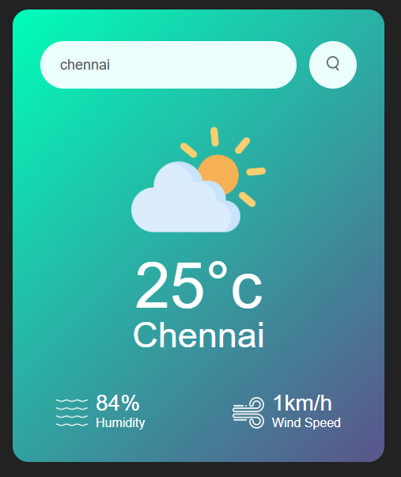

# JavaScript Weather-App

## The weather app is a simple project to help me learn JavaScript and put the syntax and methods into practice.

## Installation
1. Clone the repo:
   ```bash
   git clone https://github.com/kkavinkk/Weather-App.git

2. Launch with:
   ```bash
   node server.mjs

3. Stop server with:
   Ctrl + c

### **1. Usage**
Simpily enter the name of a city you want to find.



*Figure 1: Shows the city you have entered*

### **2. Features**
Key functionalities or features of the project.

- Catches misspelled city names
- Shows nothing when no city is entered
- Always shows live weather information

A learning project by Kavin. K
